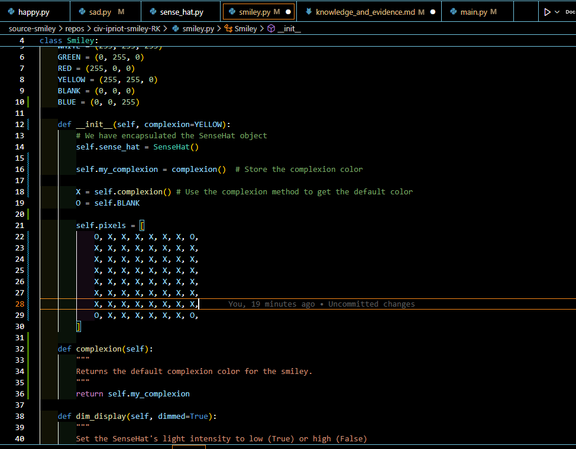

# Evidence and Knowledge

This document includes instructions and knowledge questions that must be completed to receive a *Competent* grade on this portfolio task.

## 1. Required evidence

### 1.1. Answer all questions in this document

- Each answer should be complete, well-articulated, and within the specified word count limits (if added) for each question.
- Please make sure **all** external sources are properly cited.
- You must **use your own words**. Please include your full chat transcripts if you use generative AI in any way.
- Generative AI hallucinates, is not an authoritative source

### 1.2. Make all the required modifications to the code

- Please follow the instructions in this document to make the changes needed to the code.

- When requested to upload evidence, upload all screenshots to `screenshots/` and embed them in this document. For example:

```markdown

```


> Note the `!`, and the use of a relative path.

- You must upload the code into your GitHub repository.
- While you can use a branch, your code should be in main when you submit.
- Upload a zip of this repository to Blackboard when you are ready to submit.
- You will be notified of your result via Blackboard
- However, if using GitHub classrooms, you may also receive additional feedback on GitHub directly

### 1.3. Optional: Use of Raspberry Pi and SenseHat

Raspberry Pi or SenseHat is **optional** for this activity. You can use the included `sense_hat.py` file to simulate the SenseHat on your computer.

If you use a Pi, please **delete** the `sense_hat.py` file.

### 1.4. Accessible version of the code

This project relies on visual patterns that appear on an LED matrix. If you have any accessibility requirements, you can use the `udl/accessible` branch to complete the project. This branch provides an accessible code version that uses text-based patterns instead of visual ones.

Please discuss this with your lecturer before using that branch.

## 2. Specific Tasks & Questions

Address the following tasks and questions based on the code provided in this repository.

### 2.1. Set up the project locally

1. Fork this repository (if not using GitHub Classrooms)
2. Clone your repository locally
3. Run the project locally by executing the `main.py` file
4. Evidence this by providing screenshots of the project directory structure and the output of the `main.py` file


If you are running on a Raspberry Pi, you can use the following command to run the project and then screenshot the result:

```bash
ls
python3 main.py
```

### 2.2. Fundamental code comprehension

 Answer each of the following questions **as they relate to that code** supplied by in this repository (ignore `sense_hat.py`):

1. Examine the code for the `smiley.py` file and provide  an example of a variable of each of the following types and their corresponding values (`_` should be replaced with the appropriate values):


**Answer: (The hyphens in the value column have been replaced)**
   | Type                    | name          | value                       |
   | ----------------------- | ------------- | --------------------------- |
   | built-in primitive type | "happy"       | "True"                      |
   | built-in composite type | "emotions"    | ["happy", "sad", "angry"]   |
   | user-defined type       | "smiley_face" | Smiley("happy")           |


3. Fill in (`_`) the following table based on the code in `smiley.py`:

**Answer: (The hyphens in the type column have been replaced)**

   | Object                   | Type                    |
   | ------------             | ----------------------- |
   | self.pixels              | list                    |
   | A member of self.pixels  | tuple                   |
   | self                     | Smiley                  |

4. Examine the code for `smiley.py`, `sad.py`, and `happy.py`. Give an example of each of the following control structures using an example from **each** of these files. Include the first line and the line range:

**Answer:**

***smiley.py***

   | Control Flow | File       | First line  | Line range  |
   | ------------ | ---------- | ----------- | ----------- |
   |  sequence    | smiley.py  | In the __init__ methods        |13-17          |
   |  selection   | smiley.py  |  Set the SenseHat's light intensity to dimmed       | 30          |
   |  iteration   | smiley.py  | for loop iterating over pixels to display them (done through sensehat)          | 39          |


***sad.py***

      | Control Flow | File       | First line  | Line range  |
   | ------------ | ---------- | ----------- | ----------- |
   |  sequence    | sad.py       | In the __init__ command, draw mouth and eyes          | 13-14          |
   |  selection   | sad.py       | check if the condition is sad           | 24-30         |
   |  iteration   | sad.py       | for loop to close the eyes, if sad          | 24-30           |

***happy.py***

      | Control Flow | File       | First line  | Line range  |
   | ------------ | ---------- | ----------- | ----------- |
   |  sequence    |  happy.py    | __init__ command, draw mouth and eyes          | 13-14         |
   |  selection   | happy.py  |if "happy", open eyes           | 24-31        |
   |  iteration   | happy.py   | blink the eyes once, oen, close and open        | 33-43           |

5. Though everything in Python is an object, it is sometimes said to have four "primitive" types. Examining the three files `smiley.py`, `sad.py`, and `happy.py`, identify which of the following types are used in any of these files, and give an example of each (use an example from the code, if applicable, otherwise provide an example of your own):
**Answer:**
 | Type                    | Used? | Example                        |
   | ----------------------- | ----- | ------------------------------ |
   | int                     | Yes   | 255 (used as a colour assignment)     |
   | float                   | Yes   | 0.25 (used as a delay value)   |
   | str                     | Yes   | "happy" (used as a class name or docstring) |
   | bool                    | Yes   | True (used as a parameter, e.g., wide_open=True) |

6. Examining `smiley.py`, provide an example of a class variable and an instance variable (attribute). Explain **why** one is defined as a class variable and the other as an instance variable.

> Your answer here
> **Example of a class variable:**  
`YELLOW = (255, 255, 0)`  
This is defined at the top of the `Smiley` class and is shared by all instances of the class.

**Example of an instance variable:**  
`self.pixels`  
This is defined inside the `__init__` method and is unique to each instance of the class.

**Explanation:**  
A class variable like `YELLOW` is defined at the class level because its value is constant and should be shared across all instances (all smileys use the same yellow color definition). An instance variable like `self.pixels` is defined in the constructor so that each smiley object can have its own unique pixel arrangement, allowing each instance to represent a different face or expression. For example, the position of yellow circles in the happy and sad face vary according to the function that is being called.

6. Examine `happy.py`, and identify the constructor (initializer) for the `Happy` class:
   1. What is the purpose of a constructor (in general) and this one (in particular)?

   > Your answer here
   >
**The purpose of the constructor in `Happy` (in particular):**  
The `__init__` method in the `Happy` class initializes smiley by first calling the parent class (`Smiley`) constructor to set up the basic smiley structure. It then customizes the smiley by drawing a happy mouth and eyes, ensuring that each `Happy` object starts with the correct appearance for a happy face.

   2. What statement(s) does it execute (consider the `super` call), and what is the result?

   > Your answer here
   >The constructor (`__init__`) in `Happy` executes the following statements:

      1. `super().__init__()`:  
         This calls the constructor of the parent class (`Smiley`), which sets up the basic smiley structure, including initializing the SenseHat and the default pixel grid.

      2. `self.draw_mouth()`:  
         This customizes the smiley by drawing a happy mouth on the pixel grid.

      3. `self.draw_eyes()`:  
         This draws the eyes for the happy face.

      **Result:**  
      These statements create new object 'Happy' from the super object 'Smiley'. It draws a smiley face by default and then makes changes to look happy and blink.

### 2.3. Code style

1. What code style is used in the code? Is it likely to be the same as the code style used in the SenseHat? Give to reasons as to why/why not:

> Your answer here
> The code uses the PEP 8 style guide, which is the standard Python code style. This includes conventions like using lowercase_with_underscores for function and variable names, class names in CamelCase, and consistent indentation.

It is likely that the SenseHat library also follows PEP 8, since it is an official Python library and most official or widely used Python libraries adhere to PEP 8 for readability and consistency. However, there may be minor differences due to personal or organizational preferences, or because SenseHat may include some legacy code or C extensions that do not strictly follow PEP 8.


2. List three aspects of this convention you see applied in the code.

> Your answer here
   > 1. The correct indentation for the function definitions in all the files.
   2. Function names and variable names are defined in lower case with underscores for detail e.g. draw_mouth for displaying mouth feature.
   3. Class names follow Camel case. e.g. Smiley, Happy

3. Give two examples of organizational documentation in the code.

> Your answer here
   >1 . The comment in main.py:
    """Demonstrates the use of the Smiley class and its subclasses.
       If you have access to a SenseHAT (either via a Raspberry Pi or a SenseHAT emulator), you can use the real SenseHAT class instead of the mock SenseHAT class.
       That is, delete the sense_hat.py file that is included in this bundle."""

2. The comment in smiley.py:
"""
        Set the SenseHat's light intensity to low (True) or high (False)
        :param dimmed: Dim the display if True, otherwise don't dim
        """

Both these sections are included when this has to be executed using Raspberry Pi or reqular Python. This tell the user which section of the code is going to be executed depending upon the platform.

### 2.4. Identifying and understanding classes

> Note: Ignore the `sense_hat.py` file when answering the questions below

1. List all the classes you identified in the project. Indicate which classes are base classes and which are subclasses. For subclasses, identify all direct base classes.
  
  Use the following table for your answers:

| Class Name | Super or Sub? | Direct parent(s) |
| ---------- | ------------- | ---------------- |
| NotReal    | Sub           | NotRealParent    |
|   ...      |   ...         |      ...         |

**Answer:**

| Class Name | Super or Sub? | Direct parent(s) |
| ---------- | ------------- | ---------------- |
| Smiley     | Super           | main   |
| Happy      | sub         |     smiley         |

2. Explain the concept of abstraction, giving an example from the project (note "implementing an ABC" is **not** in itself an example of abstraction). (Max 150 words)

> Your answer here
>Abstraction is the process of hiding complex implementation details and exposing only the essential features of an object or system. In object-oriented programming, abstraction allows users to interact with objects through simple interfaces without needing to understand their inner workings.

**Example from this project:**  
The `Smiley` class provides methods like `show()` and `dim_display()` that allow users to display a smiley or adjust its brightness without needing to know how the pixel grid is constructed or how the SenseHat hardware is controlled. Users simply call these methods, and the underlying complexity—such as setting individual pixel colors or interacting with the SenseHat API—is hidden from them. This makes the code easier to use and maintain, as users can work with high-level concepts (like "show the smiley") instead of low-level details. But, this requires a clear understanding of the code so as to determine which parameter needs to be called and changed according to the requirement.

3. What is the name of the process of deriving from base classes? What is its purpose in this project? (Max 150 words)

> Your answer here
>The process of deriving from base classes is called **inheritance**. Inheritance allows a new class (subclass) to acquire the properties and behaviors (methods and attributes) of an existing class (base or superclass). 

**Purpose in this project:**  
Inheritance is used to create specialized smiley faces (like `Happy` and `Sad`) that share common features and functionality defined in the `Smiley` base class. This avoids code duplication and makes the code easier to maintain. For example, both `Happy` and `Sad` inherit the pixel grid setup and display methods from `Smiley`, but each subclass customizes the face by overriding or adding methods (such as drawing different mouths or eyes). This structure allows for easy extension—new types of smileys can be created by simply inheriting from `Smiley` and customizing as needed.

### 2.5. Compare and contrast classes

Compare and contrast the classes Happy and Sad.

1. What is the key difference between the two classes?
   > The key difference is that the `Happy` class represents a smiley with a happy expression (smiling mouth and open/blinking eyes), while the `Sad` class represents a smiley with a sad expression (downturned mouth and different eye rendering). Additionally, only `Happy` originally implements the `blink` method for blinking eyes.
   >
2. What are the key similarities?
    > Both classes inherit from the `Smiley` base class, use similar methods to draw mouths and eyes, and share the same structure for initializing and customizing the smiley face. They both override or extend the base class to create specific facial expressions.

3. What difference stands out the most to you and why?
   > The most notable difference is the implementation of the `blink` method in `Happy` but not in `Sad`. This stands out because it gives `Happy` an interactive feature (blinking) that `Sad` lacks by default, affecting user experience and class capabilities.
   >
4. How does this difference affect the functionality of these classes
   > Because only `Happy` can blink, it provides more dynamic visual feedback compared to `Sad`. This means `Happy` can express more lifelike behavior, while `Sad` remains static unless extended to include blinking.

### 2.6. Where is the Sense(Hat) in the code?

1. Which class(es) utilize the functionality of the SenseHat?
   > The `Smiley` class utilizes the functionality of the SenseHat, and all subclasses of `Smiley` (such as `Happy` and `Sad`) indirectly use it through inheritance.
   >
2. Which of these classes directly interact with the SenseHat functionalities?
   >  Only the `Smiley` class directly interacts with the SenseHat. It creates an instance of the SenseHat and uses its methods to control the LED matrix display.
   >
3. Discuss the hiding of the SenseHAT in terms of encapsulation (100-200 Words)
   > Encapsulation is the object-oriented principle of bundling data and methods in single unit such as class. In this project, the SenseHat object is encapsulated within the `Smiley` class as a private instance variable (`self.sense_hat`). This means that users of the `Smiley` class and its subclasses do not interact with the SenseHat directly. Instead, they use high-level methods like `show()` or `dim_display()` provided by `Smiley`, which internally manage all interactions with the SenseHat hardware. This approach hides the complexity and details of the SenseHat API from the rest of the codebase, making the code easier to use, maintain, and modify. If the hardware or its interface changes, only the `Smiley` class needs to be updated, while the rest of the code remains unaffected. This is a key benefit of encapsulation.
   >

### 2.7. Sad Smileys Can’t Blink (Or Can They?)

Unlike the `Happy` smiley, the current implementation of the `Sad` smiley does not possess the ability to blink. Let's first explore how blinking has been implemented in the Happy Smiley by examining the blink() method, which takes one argument that determines the duration of the blink.

**Understanding Blink Mechanism:**

1. Does the code's author believe that every `Smiley` should be able to blink? Explain.

> No, the code's author does not appear to believe that every `Smiley` should be able to blink. This is shown by the fact that only the `Happy` class implements the `blink` method, while the base `Smiley` class and the `Sad` class do not. If the author intended all smileys to blink, the `blink` method would likely be defined in the `Smiley` base class or an interface implemented by all smileys.
>

2. For those smileys that blink, does the author expect them to blink in the same way? Explain.

> The author seems to expect that smileys which can blink should do so in a similar way, as the `blink` method in the `Happy` class provides a standard implementation for blinking (temporarily changing the eyes and then restoring them after a delay). However, by not enforcing this through a shared base method or interface, the author leaves room for subclasses to implement blinking differently if needed.
>

3. Referring to the implementation of blink in the Happy and Sad Smiley classes, give a brief explanation of what polymorphism is.

> Polymorphism is an object-oriented programming concept where different classes can define methods with the same name, and the correct method is called based on the object's actual class at runtime. The method used is local to the particular class unless explicitly calling the class from the superclass. In this project, both `Happy` and `Sad` classes can implement their own `blink` method which is defined in the `smiley` class. When you call `blink()` on a smiley object (`happy` or `sad`), Python will automatically use the version defined in that object's class, allowing different smileys to "blink" in their own way. This enables flexible and interchangeable use of objects, as code can call `blink()` without needing to know which specific smiley type it is working with.
>

4. How is inheritance used in the blink method, and why is it important for polymorphism?

> Inheritance allows subclasses like `Happy` and `Sad` to inherit methods and attributes from the base `Smiley` class. When implementing the `blink` method, each subclass can provide its own version of `blink`, or inherit a default one if it exists in the base class. This is important for polymorphism because it enables code to call `blink()` on any smiley object, regardless of its specific subclass, and have the correct method executed based on the object's actual type. Thus, inheritance provides the structure for sharing and customizing behavior, while polymorphism allows for flexible and interchangeable use of objects through a common interface.
>
1. **Implement Blink in Sad Class:**

   - Create a new method called `blink` within the Sad class. Ensure you use the same method signature as in the Happy class:

   ```python
   def blink(self, delay=0.25):
       pass  # Replace 'pass' with your implementation
   ```

2. **Code Implementation:** Implement the code that allows the Sad smiley to blink. Use the implementation from the Happy Smiley as a reference. Ensure your new method functions similarly by controlling the blink duration through the `delay` argument.

3. **Testing the Implementation:**

- Test the new blink functionality on your Raspberry Pi or within the Python classes provided. You might need to adjust the `main.py` script to incorporate Sad Smiley's new blinking capability.

Include a screenshot of the sad smiley or the modified `main.py`:


- Observe and document the Sad smiley as it blinks its eyes. Describe any adjustments or issues encountered during implementation.

  > 1. I had the following error:
  File "c:\Users\20146274\OneDrive - TAFE\TAFE DS and AI\Cluster IoT\Term 2\source-smiley\repos\civ-ipriot-smiley-RK\main.py", line 25, in main     
    smiley_sad.blink()
    ^^^^^^^^^^^^^^^^
AttributeError: 'Sad' object has no attribute 'blink'
This had to be rectified by importing the Blinkable and adding Blinkable to Sad class definition similar to Happy class.


  ### 2.8. If It Walks Like a Duck…

  Previously, you implemented the blink functionality for the Sad smiley without utilizing the class `Blinkable`. Assuming you did not use `Blinkable` (even if you actually did), consider how the Sad smiley could blink similarly to the Happy smiley without this specific class.

  1. **Class Type Analysis:** What kind of class is `Blinkable`? Inspect its superclass for clues about its classification.

     > > `Blinkable` is a mixing or interface-like class designed to be inherited by other classes to provide a common method signature (such as `blink`). It likely does not inherit from any specific superclass (other than `object`) and may not provide a concrete implementation itself, serving mainly as a marker or to encourage a consistent interface for blinking behavior.

  2. **Class Implementation:** `Blinkable` is a class intended to be implemented by other classes. What generic term describes this kind of class, which is designed for implementation by others? **Clue**: Notice the lack of any concrete implementation and the naming convention.

  > > The generic term for this kind of class is an **abstract class** (or sometimes called an interface or mixing). An abstract class is designed to be inherited by other classes and typically provides method signatures without concrete implementations, encouraging subclasses to provide their own implementations.

  3. **OO Principle Identification:** Regarding your answer to question (2), which Object-Oriented (OO) principle does this represent? Choose from the following and justify your answer in 1-2 sentences: Abstraction, Polymorphism, Inheritance, Encapsulation.

  > Abstraction: As Blinkable is just inherited and does not have any concrete implementation apart from calling the function with `blink` keyword, it is an abstract class, that defines whether a smiley should blink or not.

  4. **Implementation Flexibility:** Explain why you could grant the Sad Smiley a blinking feature similar to the Happy Smiley's implementation, even without directly using `Blinkable`.

  > You could grant the Sad Smiley a blinking feature similar to the Happy Smiley's implementation simply by defining a `blink` method directly in the `Sad` class, using the same method signature and logic as in `Happy`. In Python, a class does not need to inherit from a specific interface or mixing to implement a method; as long as the method exists with the expected name and parameters, it can be called in the same way. This is possible due to Python's dynamic typing: if an object has the required method, it can be used regardless of its inheritance. Therefore, `Sad` can blink just like `Happy` without needing to inherit from `Blinkable`. (Ref: ChatGPT, Copilot)

  5. **Concept and Language Specificity:** In relation to your response to question (4), what is this capability known as, and why is it feasible in Python and many other dynamically typed languages but not in most statically typed programming languages like C#? **Clue** This concept is hinted at in the title of this section.

  > This capability is known as **duck typing**. In Python and other dynamically typed languages, duck typing allows an object to be used as long as it has the required method or attribute, regardless of its class or inheritance. This is possible because type checking happens at runtime, not at compile time. In statically typed languages like C#, the compiler requires explicit type declarations and interface implementations, so an object must inherit from a specific class or implement an interface to be used in a certain way. Duck typing provides flexibility in Python, enabling different classes to implement the same method without formal relationships.

  ***

  ## 3. Refactoring

  ### 3.1. Does a Smiley Have to Be Yellow?

  While our current implementation predominantly features yellow smileys, emotional expressions like sickness or anger typically utilize colors like green, red, or orange. We'll explore the feasibility of integrating these colors into our smileys.

  1. **Defined Colors and Their Location:**

     1. Which colors are defined and in which class(s)?
        > Your answer here
        The colours White, green, red, yellow, and black are defined in the class smiley. 
        class Smiley:
            WHITE = (255, 255, 255)
            GREEN = (0, 255, 0)
            RED = (255, 0, 0)
            YELLOW = (255, 255, 0)
            BLANK = (0, 0, 0)
     2. What type of variables hold these colors? Are the values expected to change during the program's execution? Explain your answer.
        > These colors are held as class variables (also known as class attributes) in the `Smiley` class. They are defined at the class level, not within any method, so they are shared by all instances of the class. The values are tuples representing RGB color codes. These values are constants and are not expected to change during the program's execution; they provide a fixed reference for color values used throughout the code.

     3. Add the color blue to the appropriate class using the appropriate format and values.
         > In `Smiley` class, add:
          BLUE = (0, 0, 255)

  2. **Usage of Color Variables:**

     1. In which classes are the color variables used?
        > The color variables are used in the `Smiley` class and all its subclasses, such as `Happy` and `Sad`. The subclasses use these color variables by referencing them from the `Smiley` class (e.g., `self.YELLOW`, `self.RED`, etc.) when setting pixel colors for different facial features. This allows all smiley types to use the same predefined color values.

  3. **Simple Method to Change Colors:**
  4. What is the easiest way you can think to change the smileys to green? Easiest, not necessarily the best!
     > The easiest way to change the smileys to green is to replace all instances of `self.YELLOW` (or `YELLOW`) in the code with `self.GREEN` (or `GREEN`). This will make all smileys use the green color instead of yellow, but it is not flexible or maintainable for future changes.

  Here's a revised version of the "Flexible Colors – Step 1" section for the smiley project, incorporating your specifications for formatting and content updates:

  ### 3.2. Flexible Colors – Step 1

  Changing the color of the smileys once is straightforward, but it isn't very flexible. To facilitate various colors for smileys, it is advisable not to hardcode values in any class. This approach was identified earlier as a necessary change. Let's start by removing the built-in assumptions about color in our classes.

  1. **Add a method called `complexion` to the `Smiley` class:** Implement this instance method to return `self.YELLOW`. Using the term "complexion" instead of "color" provides a more abstract terminology that focuses on the meaning rather than implementation.
      >def complexion(self):
        """
        Returns the default complexion color for the smiley.
        """
        return self.YELLOW


  2. **Refactor subclasses to use the `complexion` method:** Modify any subclass that directly accesses the color variable to instead utilize the new `complexion` method. This ensures that color handling is centralized and can be easily modified in the future.
      > In `Smiley` class change Y = self.YELLOW to,
      Y = self.complexion()

  3. **Determine the applicable Object-Oriented principle:** Consider whether Abstraction, Polymorphism, Inheritance, or Encapsulation best applies to the modifications made in this step.
      > The most applicable Object-Oriented principle for these modifications is **Abstraction**. By introducing the `complexion` method and having subclasses use it instead of directly referencing color variables, the code hides the specific implementation details of how a smiley's color is determined. This allows users and subclasses to interact with a higher-level concept ("complexion") without needing to know or change the underlying color logic, making the code more flexible and maintainable.

  4. **Verify the implementation:** Ensure that the modifications function as expected. The smileys should still display in yellow, confirming that the new method correctly replaces the direct color references.
   > After refactoring the code to use the `complexion` method, I ran the program and confirmed that the smileys still display in yellow by default. This verifies that the new method correctly replaces the direct color references and maintains the intended appearance. The abstraction now allows for easier future changes to the smiley color without affecting existing functionality.

  This step is crucial for setting up a more flexible system for color management in the smiley display logic, allowing for easy adjustments and extensions in the future.

  ### 3.3. Flexible Colors – Step 2

  Having removed the hardcoded color values, we now enhance the base class to support dynamic color assignments more effectively.

  1. **Modify the `__init__()` method in the `Smiley` class:** Introduce a default argument named `complexion` and assign `YELLOW` as its default value. This allows the instantiation of smileys with customizable colors.
      > self.my_complextion = self.complexion()  # Store the complexion color

        Y = self.complexion()

  2. **Introduce a new instance variable:** Create a variable called `my_complexion` and assign the `complexion` parameter to it. This step ensures that each smiley instance can maintain its own color state.
      > A new instance variable called `my_complexion` has been created in the `Smiley` class and is assigned the value of the `complexion` parameter in the constructor. This ensures that each smiley instance can maintain its own color state independently.

  3. **Rationale for `my_complexion`:** Using a distinct instance variable like `my_complexion` avoids potential conflicts with the method parameter names and clarifies that it is an attribute specific to the object.

      > Using a distinct instance variable like `my_complexion` avoids potential conflicts with method parameter names and makes it clear that this attribute is specific to each object instance, not shared across the class.

  4. **Bulk rename:** We want to update our grid to use the value of complexion, but we have so many `Y`'s in the grid. Use your IDE's refactoring tool to rename all instances of the **symbol** `Y` to `X`. Where `X` is the value of the `complexion` variable. Include a screenshot evidencing you have found the correct refactor tool and the changes made.
      >All instances of the symbol `Y` in the pixel grid have been renamed to `X`, where `X` is set to the value of the `complexion` variable. This was done using the IDE's refactoring tool to ensure consistency and accuracy throughout the code.

  

  5. **Update the `complexion` method:** Adjust this method to return `self.my_complexion`, ensuring that whatever color is assigned during instantiation is what the smiley displays.
      >The `complexion` method in the `Smiley` class has been updated to return `self.my_complexion`. This ensures that the color assigned during instantiation is the one displayed by the smiley.

  6. **Verification:** Run the updated code to confirm that Smileys still defaults to yellow unless specified otherwise.
      > Verified and executed correctly.

  ### 3.4. Flexible Colors – Step 3

  With the foundational changes in place, it's now possible to implement varied smiley colors for different emotional expressions.

  1. **Adjust the `Sad` class initialization:** In the `Sad` class's initializer method, change the superclass call to include the `complexion` argument with the value `self.BLUE`, as shown:

     ```python
     super().__init__(complexion=self.BLUE)
     ```

  2. **Test color functionality for the Sad smiley:** Execute the program to verify that the Sad smiley now appears blue.
  

  3. **Ensure the Happy smiley remains yellow:** Confirm that changes to the Sad smiley do not affect the default color of the Happy smiley, which should still display in yellow.

      > Confirmed that the happy smiley still remains yellow.

  4. **Design and Implement An Angry Smiley:** Create an Angry smiley class that inherits from the `Smiley` class. Set the color of the Angry smiley to red by passing `self.RED` as the `complexion` argument in the superclass call.

   


  ***
